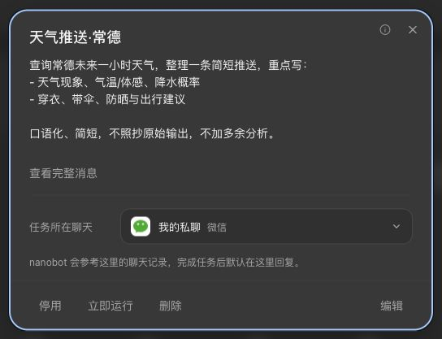
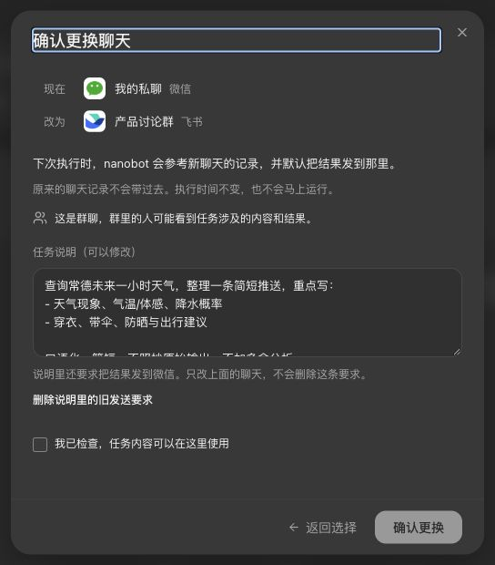

# Automation chat proposal

Draft for design review. This is a runnable UI prototype, not a working change
to automation routing. It does not change the production build or gateway.

## Problem

Automation details show the channel, such as “WeChat”, but not the specific
conversation. Users cannot check where a task runs and replies. Some put raw
`channel` and `chat_id` instructions in the task prompt to control delivery.
The display gap is confirmed in the source. A wrong-recipient incident has not
been reproduced from the reports.

The interface should answer two questions in plain language:

- Which chat does this task use?
- If I change it, what happens to the next run?

## Proposed interaction

Use the existing Automations page and detail dialog. Show a channel logo on the
left, then the chat name and platform. The Chinese label is “任务所在聊天”
(“Task chat”). Do not show an invented account label or an unexplained ID suffix.
Production must still distinguish real same-name chats or topics when needed.

1. Keep the saved chat selected by default. Do not infer it from the latest chat.
2. Selecting another chat opens a review step in the same dialog.
3. Show the old and new chats. Explain that future runs use the new chat's
   history and reply there by default. Old chat history stays where it is.
4. Let the user review and edit the task prompt. Warn when the target is a group.
5. Require confirmation that the prompt is suitable for the new chat.
6. Change the displayed saved chat only after the save succeeds. Keep the draft
   after a conflict or when the user returns to select another chat.

Changing a chat must not run the task, change its schedule, or enable a paused
task. Keep the page mounted during review and show save progress next to the
action. Do not replace the page with a spinner or report success before an
acknowledgement. This follows the interaction principle discussed in
[The perfect app has no loading states](https://floriankiem.com/writing/the-perfect-app-has-no-loading-states).

## Decision needed before implementation

The maintainer rejected an independent result-delivery target in
[#5513](https://github.com/HKUDS/nanobot/issues/5513#issuecomment-5488297111)
and repeated that concern on
[#5620](https://github.com/HKUDS/nanobot/pull/5620#issuecomment-5534384796).
Running in chat A and sending the result to chat B separates the reply from its
history and can expose context from A.

This proposal does **not** add a delivery override. It proposes changing the
whole binding for future runs: execution chat, recorded result, and default
reply destination move together. This still changes the current rule that a
task stays in its creation chat. Maintainer approval is pending.

Implement this in two stages:

- **A: Read-only identity.** Show the exact bound chat when the gateway can
  resolve it. If it cannot, say that the chat is unknown. Keep all bindings and
  execution behavior unchanged. This stage can ship independently.
- **B: Explicit chat change.** Add the selector only after agreement on the
  binding change and after the gateway contract is implemented and verified.
  If the decision is no, keep A and direct users to create the task in the
  intended chat.

## Gateway contract required for stage B

The gateway owns identity, authorization, execution, and persistence. The client
must not assemble a route from a channel name or provide platform credentials.
A possible operation is `change_binding(job_id, target_ref, expected_revision,
reviewed_message)`; this is a proposal, not an existing API.

- Resolve the target in the same host, configuration, and workspace. A connected
  channel does not prove that a recipient or topic is valid or authorized.
- Initially support ordinary scheduled agent jobs only. Keep system jobs,
  local triggers, unified-session mode, temporary/deleted chats, and cross-host
  moves read-only. Do not allow arbitrary recipient IDs or multiple recipients.
- Check job revision and running/queued state in the same serialized operation
  that changes the binding. Do not check in HTTP and then write without a guard.
- Save the complete binding and reviewed prompt together. A failed write keeps
  the old in-memory and persisted values. Task admission must observe either the
  old binding or the new one, never part of each.
- Preserve enabled state, schedule, timezone, and scheduled occurrence. A save
  must not create an extra run or lose work already admitted.
- Preserve the target used by each historical run. Never fill old history with
  the current target. If the old target was not recorded, report it as unknown.
- Do not copy messages, summaries, transcripts, or files from the previous chat.
  This does not create new isolation for shared workspace files or memory.
- Require prompt review: explicit `message` instructions can still send to a
  different destination. The selector is not an outbound-message sandbox.
  Never rewrite arbitrary prompts automatically.

Use existing session/channel ownership to resolve identities and routes. Keep
the atomic update in the cron owner, not the client. Do not introduce WebUI
policy in `agent/loop.py` or `agent/runner.py`.

At base `948ce382`, `nanobot/webui/session_automations.py::_origin_payload`
returns only channel and empty display text for non-WebSocket jobs. The detail
panel renders that channel label. `nanobot/agent/tools/cron.py` captures the
creation route; `nanobot/cron/bound_runner.py` and `session_delivery.py` consume
the binding. Legacy `channel`/`to` fields are not an API for changing the modern
session binding.

## Compatibility and acceptance gates

Stage A should add optional read fields. Stage B needs an optional capability;
older hosts must not receive the new mutation. Ordinary edits and existing jobs
must continue to work. Any new persisted revision/audit fields need explicit
restart and rollback rules before stage B can ship.

Required evidence before enabling real saves:

- A default run and a moved run use the correct chat history, recorded turn,
  and reply route. A reply in the target chat can continue the task.
- Task admission versus save, two-tab updates, write failure, and restart do not
  produce a partial binding, double delivery, or false success.
- Invalid, deleted, foreign, or unauthorized targets are rejected. Same-name
  chats and topic/account routes remain distinguishable.
- Paused and scheduled jobs retain their state. Running or queued jobs reject
  the change. A busy target chat retains normal queue behavior.
- Supported old/new client-host combinations, missing capability, reconnect,
  and a late response after host switching preserve the correct host scope.
- Desktop and narrow mobile layouts, keyboard selection, cancellation, prompt
  review, failed saves, and save/read-back are verified.

These are implementation gates, not claims about this prototype.

## Screenshots

Synthetic data from this opt-in preview; neither screen changes a real task.





## Run the prototype

Install the existing WebUI dependencies with the repository's usual setup.
From `webui/`:

```sh
node node_modules/typescript/bin/tsc --noEmit -p proposals/automation-chat/tsconfig.json
node node_modules/vite/bin/vite.js build --config proposals/automation-chat/vite.config.ts
node node_modules/vite/bin/vite.js preview --config proposals/automation-chat/vite.config.ts
```

Open `http://127.0.0.1:53822/`. For the weather details, open
`http://127.0.0.1:53822/?detail&theme=dark`.
Use the preview menu to compare current/proposed UI and simulate a slow save,
conflict, queued task, or old host. Refresh resets all changes.

The prototype imports the real Sidebar, Automations page, dialogs, channel
logos, UI controls, translations, CSS, and Tailwind configuration. An opt-in
Vite transform replaces only the linked-chat slot and review frame in memory.
The build fails if those source anchors change. The transform is not used by
the product build and is not a proposed production extension point.

## Prototype limits

- All tasks, chat identities, and save responses are synthetic React state.
  There is no API proxy, gateway connection, model call, task run, or message
  delivery. Existing logo components may load remote brand images.
- The current fixtures have one selectable chat per platform. They do not prove
  identity resolution, recipient permissions, or same-name disambiguation.
- The old-send-instruction button removes one exact fixture block on an explicit
  click. It does not detect arbitrary routing instructions or sensitive text.
- The preview is Chinese-first. Production copy still needs all supported
  locales, including verified accessibility labels.
- Earlier UI-only browser checks covered desktop, 320/390 px layouts, draft
  retention, save acknowledgement, conflict, cancellation, and keyboard flow.
  Those checks do not prove real delivery, persistence, or physical iOS behavior.
- No production runtime, wire schema, saved data, or package dependencies change
  in this draft. This proposal is not merge-ready as a routing feature.
