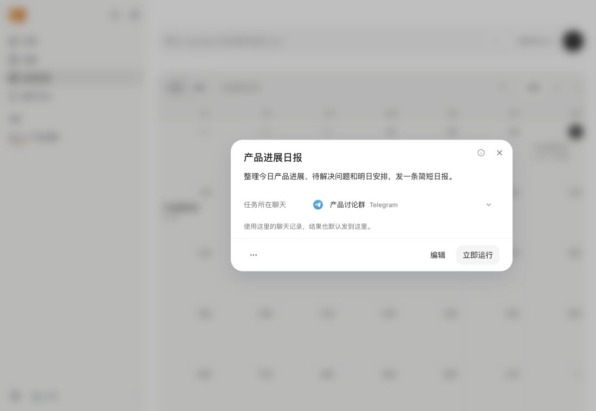
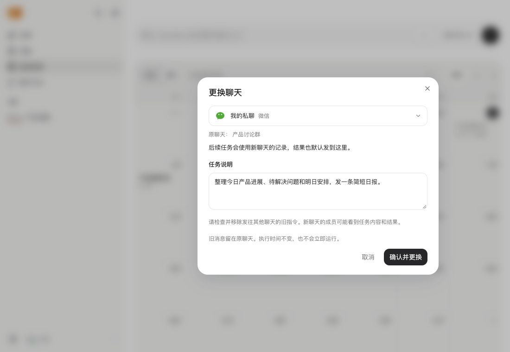

# Automation chat selection

This draft now implements chat selection in the production WebUI and Python
gateway. The earlier in-memory preview and its build transform have been removed.
See [the user guide](../../../docs/automations.md#change-the-chat-for-a-scheduled-task)
for the interaction, limits, and downgrade warning.

## Design decision

The concerns in [#5513](https://github.com/HKUDS/nanobot/issues/5513#issuecomment-5488297111)
and [#5620](https://github.com/HKUDS/nanobot/pull/5620#issuecomment-5534384796)
still apply: running in chat A and forwarding the result to chat B separates
the reply from its history and can expose context from A.

This implementation changes the whole binding for future runs: execution chat,
recorded turn, and default reply route. It does not add a delivery override or
copy old messages. It still changes the creation-chat rule. Maintainer agreement
is pending, so the PR remains a draft.

## Ownership and commit boundary

- The gateway resolves existing session handles, titles, canonical reply routes,
  channel availability, and effective workspace policy. The browser cannot submit
  a raw session key, channel, recipient, or topic address.
- `GET /api/webui/automations/chats?id=...` uses the existing API authentication.
  `automation.change_chat` uses the authenticated WebSocket mutation path. A
  direct HTTP mutation is rejected. Its values are `target_id`, `revision`, and
  the reviewed `message`.
- The gateway resolves the target again at save time. It rejects unknown,
  offline, foreign-scope, and unsupported targets. Topic address metadata is
  retained; sender identity and previous workspace policy are not copied.
- The cron owner compares the reviewed revision after merging pending CLI
  actions. It rejects while a scheduled turn owns a live execution snapshot,
  including one waiting in the agent queue. This first version conservatively
  blocks changes while any scheduled turn is active.
- One atomic write saves the whole binding and reviewed prompt before the new
  snapshot becomes live. A pre-commit write failure leaves the old state intact.
  If directory sync fails after replacement, the owner reads back that exact
  snapshot before reporting success. A binding version prevents an older CLI
  action snapshot from restoring the previous route.
- Each run retains its session identity. Before the first supported move, older
  run records are stamped with the known unchanged original binding. Audit result
  checks still verify job, run, session, status, and file path.

No new execution path, agent-loop policy, dependencies, or separate CSS system
are added. The dialog uses the existing Select, Dialog, Button, Textarea, channel
logos, and DropdownMenu. The detail dialog owns the modal lock. Confirmation is
explicit and progress stays local to that action. The page remains visible.

## Compatibility

The gateway advertises optional `webui.automation-chat.v1`; the core protocol
floor stays at 1. The optional `chat_binding_revision` job field exposes the
control only for supported jobs. A new client sends no new request to an old
host. An old client can keep using ordinary edits on a new host.

Storage paths and job IDs do not change. `bindingVersion` and per-run `sessionKey`
are additive fields with legacy defaults. The active instance still owns its
cron store and action log. **Downgrade after a move is not transparent**: follow
the backup/restore procedure in the user guide. Mixed-version cron writers after
a move are not supported. Rejected stale CLI updates are logged; retry the edit
from the current version after reading the latest task.

Explicit message-tool instructions can still override the default destination.
Prompt review is required, not automatic rewriting. The selector does not create
new isolation for shared workspace memory or files and does not guarantee that a
remote platform will accept delivery.

## Verification

The focused regression suite exercises the actual HTTP/WebSocket gateway,
session manager, scheduler, agent queue, persistence, and audit reader. It
checks save/read-back, execution history and outbound topic routing, old results,
revision conflict, pre/post-replace errors, stale CLI actions, running jobs,
scope and route filtering, and old-host UI behavior.

Browser checks use the normal production build served by an isolated real
gateway. Chat data, model replies, and channel status are synthetic. Saves are
persisted to a temporary cron store; model network calls and external channel
senders are not started. Checks cover restart/read-back, running a saved task,
concurrent-edit rejection with retained draft, deletion cancellation, and
desktop/320 px/390 px layouts. This is not physical-iOS or real-platform delivery
acceptance. Raw test logs and local fixture state are kept outside the repository.

## Screenshots

Both screenshots show the production app connected to that isolated gateway.

